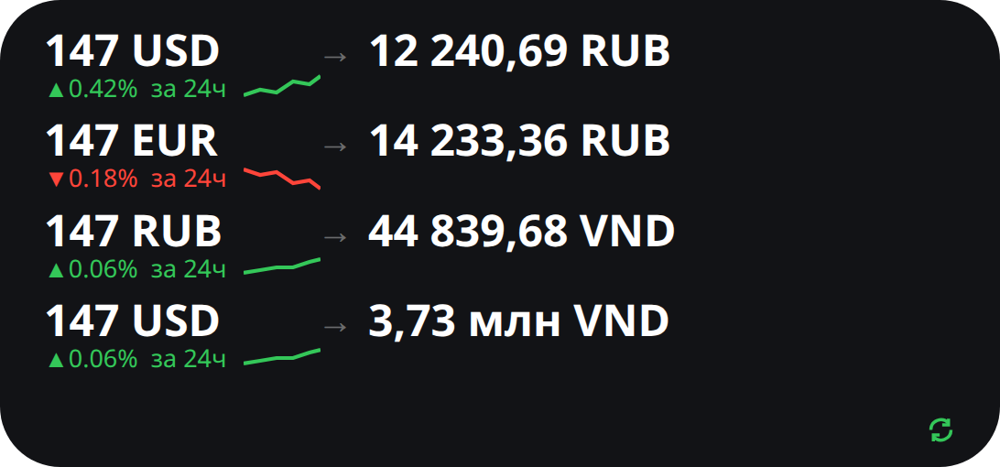
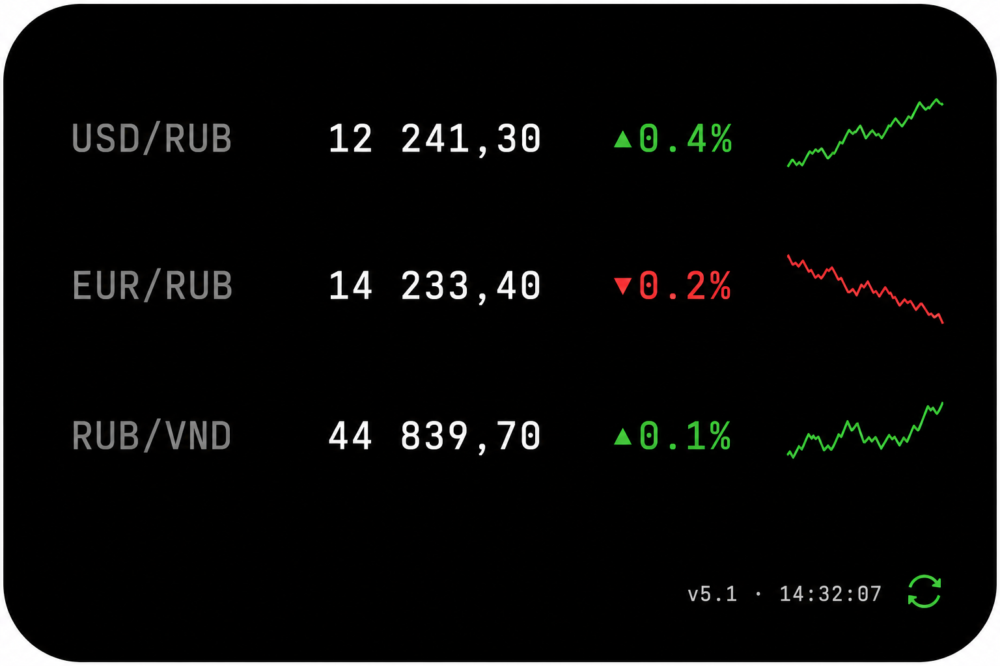

# Конвертер валют — Scriptable

Home Screen виджет на **Scriptable** (см. `notes/currency_converter_options.md`,
вариант 2): курсы валют на виду + интерактивная конвертация суммы по тапу.
Стек и структура — по образцу `../vocab-iphone-widget/`.

## ⚠️ Если виджет выглядит не так, как в описании ниже

Самая частая причина — **на телефоне не тот код**, а не баг в новой версии.
Виджет на Home Screen (в отличие от запуска ▶ Play внутри приложения)
**не обновляет свою логику при каждой перерисовке** — он использует то, что
было скачано при последнем ручном запуске. Если после моих правок ты просто
смотрел на виджет / тапал по нему на Home Screen, а не открывал сам
**скрипт в приложении Scriptable и не нажимал там ▶ Play** — на экране всё
ещё могла показываться логика от одной из промежуточных версий, а не
последняя. С v4.1 виджет умеет обновлять код сам, но только если кэш кода
старше 3 часов — поэтому после моих правок быстрее всего:

1. Открой приложение **Scriptable** (не виджет, а само приложение)
2. Найди скрипт `CurrencyConverter` в списке и нажми на него → ▶ **Play**
3. Должно открыться меню — в заголовке будет написано **«Конвертер валют · vX.X»**
4. Сверь номер версии с тем, что в этом README (сейчас `5.2`) — если меньше,
   значит обновление ещё не подтянулось (проверь сеть и попробуй ▶ Play ещё раз)
5. После этого либо подожди системной перерисовки виджета, либо удали и
   заново добавь его на Home Screen — так гарантированно перерисуется сразу

### v4.3: если и это не помогает — «ничего не меняется» на плитке

Раньше при **любой** непредвиденной ошибке внутри отрисовки виджета (а не
внутри меню) код просто молча завершался, не вызывая `Script.setWidget()` —
и WidgetKit в такой ситуации не показывает ошибку, а **оставляет на плитке
тот же самый рендер, что был до этого**, сколько угодно раз подряд. Со
стороны это выглядит ровно как «ничего не меняется», даже если реальный код
на телефоне давно новый — то есть версия в меню (`▶ Play`) может быть уже
`4.x`, а сама плитка на Home Screen выглядеть так же, как год назад.

С v4.3 это исправлено на обоих уровнях (bootstrap и основная логика): если
что-то ломается при отрисовке плитки, вместо тишины виджет покажет
**тёмно-красную аварийную плитку с текстом самой ошибки** и номером версии.
Если ты видишь такую плитку — это хороший знак: значит, код обновляется, и
дальше нужно просто прислать текст ошибки с неё, чтобы я поправил конкретный
баг. Если после обновления до `4.3`+ (см. шаги 1–5 выше) на плитке **по-прежнему
старый вид без единого визуального отличия и без красной плитки с ошибкой** —
значит, сам файл `CurrencyConverterCore.js` физически не долетает до
телефона (см. следующий раздел про версии и GitHub).

### v4.4: железный тест — перерисовывается ли плитка вообще

Рядом со значком обновления на **любом** стиле теперь есть подпись вида
`v4.4 · 14:32:07` — это не время обновления курсов, а момент, когда именно
эта плитка была физически нарисована кодом. Это самый прямой способ
проверить, доходят ли вообще изменения до Home Screen, независимо от того,
какой стиль выбран и насколько заметны визуальные отличия:

1. Открой **Scriptable** → `CurrencyConverter` → ▶ **Play**
2. В самом низу экрана появится маленькое превью виджета — посмотри на время
   рядом со значком обновления, например `v4.4 · 14:32:07`, и запомни его
3. Сразу же посмотри на настоящую плитку на Home Screen — сравни время в её
   такой же подписи с тем, что было в превью на шаге 2
4. Если время на Home Screen **сильно отстаёт** (не 14:32, а, например,
   вчерашнее или из позапрошлой правки) — значит WidgetKit действительно не
   перерисовывал плитку всё это время, и дело не в коде, а в системном
   расписании обновлений. Средство: удалить виджет с Home Screen и добавить
   заново (см. шаги выше); если и это не помогает — попробовать перезапустить
   телефон (крайняя, но иногда единственная мера против зависшего кэша
   WidgetKit) или полностью удалить и переустановить сам виджет-плитку (не
   приложение) через долгий тап → Remove Widget → добавить с нуля
5. Если время на Home Screen **совпадает или почти совпадает** с превью —
   значит перерисовка происходит исправно, а несовпадение с ожиданиями — уже
   вопрос конкретного визуального оформления стиля, а не обновления кода

### Разгадка: это не баг, это ограничение самого WidgetKit

Этой меткой времени удалось наконец получить конкретное доказательство:
плитка реально отрисовалась в правильном стиле, с правильными цифрами и
верным `CORE_VERSION` — код всё это время работал верно. Но метка показала
`00:25:19`, тогда как на телефоне было уже `12:25` — то есть **iOS не
перерисовывала плитку около 12 часов подряд**.

Это официально задокументированное поведение WidgetKit, а не что-то, что
можно починить в самом скрипте: Apple выделяет каждому виджету бюджет из
40–70 перерисовок в сутки, и система сама решает, когда его тратить —
обычно раз в 15–60 минут для часто просматриваемых виджетов, но интервал
может расти при слабом использовании, включённом режиме энергосбережения
или ограниченном фоновом обновлении. Ни один сторонний виджет (не только на
Scriptable) не может заставить iOS перерисовывать себя чаще или в реальном
времени — это сделано намеренно ради заряда батареи.

Виджет использует единственную официальную «подсказку» Scriptable для этого —
`refreshAfterDate`: просит систему не тянуть с перерисовкой курсов дольше
45 минут (для аварийной плитки с ошибкой — не дольше 5 минут, на случай если
сбой был временным). **Важно:** эта подсказка стояла в коде и раньше — то, что
на скриншоте разрыв был ~12 часов, произошло уже с ней. Это не гарантия
(система всё равно вправе подождать намного дольше при экономии заряда), а
именно подсказка «предпочтительного» момента — окончательное решение
целиком за iOS. Так что если разрыв всё ещё большой, дело не в самом коде, а
именно в настройках телефона ниже.

Что дополнительно можно проверить на телефоне, если разрыв всё ещё большой:

- **Настройки → Основные → Обновление контента в фоне** — должно быть
  включено глобально и отдельно для Scriptable
- **Настройки → Аккумулятор → Режим энергосбережения** — если включён,
  iOS резко ограничивает фоновые обновления виджетов
- Чем чаще открываешь сам виджет/приложение, тем больше бюджета на
  перерисовки система склонна выделять именно ему — это несколько дней
  накопления статистики использования, а не мгновенный эффект

### v5.0: оставлены только 2 стиля + точные референс-мокапы

Из четырёх стилей оставлены только **«Минимальный»** и **«Тикер»** — стили
«Карточки» и «Hero» полностью убраны из кода и из переключателя, чтобы не
плодить лишние варианты и сосредоточиться на двух, которые реально нужны.

Раньше единственным описанием стиля был текст в README — и то, что
получалось в реальном коде, могло не совпадать с тем, что изначально имелось
в виду словами. Теперь у каждого из двух стилей есть точный референс-мокап
(картинка ниже, в `mockups/minimal.png` и `mockups/ticker.png`) — код
реализует ровно то, что на нём: те же цвета, тот же шрифт, то же
расположение строк и подпись версии/времени в углу. Если в будущем внешний
вид на телефоне разойдётся с этими картинками — значит разошёлся именно
код, и это будет видно сразу по сравнению один-в-один, а не по словесному
описанию.

### v5.1: превью при ручном ▶ Play был непропорционально огромным — это не баг дизайна, а недостающий вызов `presentMedium()`

Если после ▶ Play в приложении вместо аккуратной маленькой плитки открывался
почти полноэкранный экран с текстом на весь экран, крестиком закрытия и
кнопкой «Поделиться» вверху — это не баг вёрстки виджета и не ограничение
задачи, а конкретная недостающая строчка кода. Без явного вызова
`widget.presentSmall()/presentMedium()/presentLarge()` Scriptable при ручном
запуске сама показывает содержимое виджета в собственном увеличенном
«быстром просмотре», который **не передаёт настоящий масштаб** плитки на
Home Screen — шрифты там нарисованы в тех же самых "поинтах", что и на
реальной маленькой плитке, но контейнер вокруг них растянут на весь экран,
поэтому всё выглядит гигантским и непропорциональным.

Исправлено: теперь после ▶ Play явно вызывается `previewWidget.presentMedium()`
— превью показывается в реальном масштабе виджета среднего размера, точно
как он будет выглядеть на Home Screen. Настоящая плитка на Home Screen (и
карточка в галерее выбора виджета при добавлении) всегда были в правильном
масштабе — непропорциональным был только этот один экран внутриприложенного
превью.

Заодно у стиля «Тикер» спарклайн теперь на каждой строке, а не только у
первой пары на large-виджете — ближе к референсу с несколькими рядами,
каждый с собственным мини-графиком.

### v5.2: строки с VND (и другими "длинными" валютами) выглядели вразнобой

Если среди пар есть валюта вроде VND, где обычная сумма превращается в
семи-восьмизначное число (например `147 USD → 3 826 947,39 VND`), эта
строка была заметно длиннее соседних (`147 USD → 12 241,3 RUB`). А так как
каждая строка ужимается по ширине независимо (`lineLimit(1)` +
`minimumScaleFactor`), длинная строка ужималась в шрифте намного сильнее —
и в итоге в одном и том же виджете строки получались визуально совсем
разного размера, что и выглядело "не так, как в примере" (там у всех строк
шрифт был одинаковый).

Исправлено: очень большие суммы (от миллиона) теперь сокращаются —
`3 826 947,39` становится `3,83 млн`, `1 200 000 000` — `1,2 млрд`. Строки
остаются примерно одной длины независимо от того, какая валюта в паре, и
шрифт больше не "скачет" между рядами.

Отдельно про баг с прозрачностью, который был в одной из версий: `ListWidget`
на Home Screen [по умолчанию должен быть непрозрачным](https://docs.scriptable.app/listwidget/#backgroundcolor),
а я явно ставил `Color.clear()`, из-за чего цветные строки сливались с обоями
и текст было не разобрать. Сейчас у каждого стиля свой явный непрозрачный фон.

**Ещё нюанс:** `raw.githubusercontent.com` и `jsdelivr` — это CDN со своим
кэшем, поэтому после `git push` в этот репозиторий новый код может доехать
туда не мгновенно, а с задержкой в несколько минут — это нормально. Если
номер версии в меню всё ещё старый сразу после пуша — подожди пару минут и
нажми ▶ Play ещё раз.

**Важнее всего:** даже когда номер версии в меню (запущенном через ▶ Play в
приложении) уже правильный — сама плитка виджета на Home Screen может
какое-то время выглядеть по-старому. Это отдельная система: iOS (WidgetKit)
перерисовывает виджет **по собственному расписанию**, а не сразу после
запуска скрипта вручную в приложении. Самый надёжный способ форсировать
немедленную перерисовку:

1. Долгий тап по виджету на Home Screen → **Remove Widget**
2. Долгий тап по пустому месту экрана → **+** → найди **Scriptable** →
   выбери размер → добавь
3. Долгий тап по новому виджету → **Edit Widget** → выбери скрипт
   `CurrencyConverter`
4. **Не забудь** сразу же в Edit Widget выставить **«When Interacting» =
   «Run Script»** — при удалении/добавлении виджета эта настройка
   сбрасывается на дефолт, и тап по виджету снова перестанет открывать меню,
   пока не проставишь её заново

## Поведение (v5) — 2 стиля виджета

По просьбе оставлены только два стиля из ранее предложенных четырёх —
«Минимальный» и «Тикер». Стиль переключается в любой момент через меню
(тап по виджету) → **«Стиль виджета»**. По умолчанию после установки —
«Минимальный».

Ниже для каждого стиля — точный референс-мокап (сгенерированное изображение,
задающее эталонный вид), лежит рядом в `mockups/`. Код в
`CurrencyConverterCore.js` реализует ровно то, что на мокапе — цвета,
шрифты, расположение строк и подпись версии/времени в углу.

### 1. Минимальный (по умолчанию)



- Сплошной тёмный фон `#121316`, без градиентов и карточек
- Плоский список `147 USD → 12 241,3 RUB`, под каждой строкой мелко и
  приглушённо — изменение курса за сутки `▲0.4%  за 24ч`, если накопилась
  история (зелёным — рост, красным — падение)
- Самый компактный и предсказуемый по вёрстке — если что-то пойдёт не так на
  экзотичном размере экрана, minimal точно влезет

### 2. Тикер



- Чёрный фон `#000000`, моноширинный шрифт — стиль биржевого терминала
- Слева тускло-серым — пара (`USD/RUB`), в центре крупно белым — только
  результат конвертации (без исходной суммы), справа — стрелка с %
  изменения и рядом с ней компактный мини-график (спарклайн) изменения
  курса за собранную историю — на **каждой** строке (`medium`/`large`), а
  не только у первой пары, как было раньше

### Тап-зоны (кроме `small`)

- Тап по конкретной паре (на `medium`/`large`) открывает быструю карточку с
  подробностями именно по этой паре, а не общее меню
- Тап по значку обновления в правом нижнем углу сразу форсирует обновление
  курсов, без открытия меню
- Тап по остальной части виджета — общее меню (см. ниже)
- На `small`-виджете тап-зоны по отдельным парам не работают (у iOS такой
  виджет поддерживает только один общий тап-таргет) — там тап всегда
  открывает общее меню

### Экран блокировки (Lock Screen, iOS 16+)

- Добавь виджет Scriptable прямо на экран блокировки — поддерживаются все три
  формата: `accessoryRectangular` (2 строки), `accessoryCircular` (код валюты
  + значение) и `accessoryInline` (одна строка в верхней части). Показывается
  первая пара из списка. Цвет там всегда монохромный — так решает сама iOS

### Общее для всех размеров/стилей

- Рядом со значком обновления — едва заметная подпись `vX.X · ЧЧ:ММ:СС`. Это
  не время обновления курсов, а **момент, когда именно эта плитка была
  физически отрисована**. Не мешает внешнему виду, но даёт железный способ
  понять, обновляется ли вообще плитка на Home Screen (см. раздел про
  диагностику выше) — просто сравни это время с текущим
- Значок обновления: зелёный, если курсы получены из сети меньше часа назад,
  тусклый — если показывается более старый кэш
- Тап по виджету (или по скрипту в приложении Scriptable) открывает меню:
  «Задать сумму для виджета», «Конвертировать сумму», «Настроить пары для
  виджета», «Стиль виджета», «Обновить курсы сейчас»
- «Задать сумму для виджета» — вводишь число один раз, и оно пересчитывается
  сразу во всех парах на виджете (например `1 USD = 83.27 RUB` становится
  `100 USD = 8 327 RUB`, и то же самое для остальных пар)
- Курсы кэшируются на устройстве — при отсутствии сети показывается последний
  известный курс с пометкой давности
- Разные виджеты на Home Screen можно настроить на разные пары через
  **Edit Widget → Parameter**, формат: `USD-RUB,EUR-RUB,USD-EUR`
- История курсов (для индикатора изменения и спарклайна) копится локально на
  устройстве, не чаще одной точки в 6 часов, хранится до ~30 последних точек

## Источники курсов (бесплатно, без ключа)

1. `open.er-api.com` — основной, обновление раз в сутки
2. `@fawazahmed0/currency-api` (jsdelivr CDN) — фолбэк №1
3. `@fawazahmed0/currency-api` (pages.dev) — фолбэк №2

Курс между любыми двумя валютами считается кросс-курсом через `USD` одним
запросом на все валюты сразу (не нужен отдельный запрос на каждую пару).

## Файлы

| Файл | Назначение |
|------|------------|
| `CurrencyConverter.js` | короткий bootstrap для Scriptable (вставить один раз) |
| `CurrencyConverterCore.js` | логика: курсы, кэш, конвертация, отрисовка виджета |

## Установка на iPhone

1. Установи бесплатное приложение **Scriptable** из App Store
2. Создай новый скрипт, назови `CurrencyConverter`
3. Вставь ВЕСЬ код из `CurrencyConverter.js` → ▶ Play
   (он сам скачает `CurrencyConverterCore.js` с GitHub)
4. Добавь виджет Scriptable на Home Screen, выбери скрипт `CurrencyConverter`
   (для экрана блокировки — долгий тап по Lock Screen → Customize → добавь
   виджет Scriptable в нужном формате и тоже выбери `CurrencyConverter`)
5. Чтобы GitHub-загрузка работала — репозиторий `projects_po` должен быть
   Public (Settings репозитория → Change visibility)

## Если тап по виджету не открывает меню

**Проверь это в первую очередь** — это самая частая причина, и код тут ни при
чём: долгий тап по виджету на Home Screen → **Edit Widget** → пункт
**«When Interacting» (При взаимодействии)** → должно быть выставлено
**«Run Script» (Запустить скрипт)**. Если там стоит что-то другое (или
значение не выбрано) — тап просто открывает приложение Scriptable, не
запуская сам скрипт, и меню в принципе не может появиться, независимо от
того, что в коде.

Второй вариант причины — сеть: раньше каждое открытие приложения по тапу пыталось
перекачать код с GitHub без ограничения по времени, и на медленном/нестабильном
соединении меню могло не успевать появиться. Теперь:

- обновление кода при тапе ограничено 7 секундами — если сеть не успела,
  просто используется уже скачанная версия и меню открывается сразу
- любая непредвиденная ошибка в скрипте показывается алертом с текстом
  ошибки вместо тихого сбоя

Если после обновления (`▶ Play` в приложении) меню всё ещё не появляется —
скорее всего, это сама иконка на Home Screen ещё не подхватила новый скрипт:
удали и заново добавь виджет, либо один раз открой скрипт в приложении и
нажми ▶ Play вручную.

## Обновить логику

Правишь `CurrencyConverterCore.js` в этом репозитории → пушишь → **на
телефоне открываешь скрипт `CurrencyConverter` в самом приложении Scriptable
и жмёшь ▶ Play (не через тап по виджету на Home Screen!)** — подтянется
свежая версия. Сразу проверь номер версии в заголовке открывшегося меню
(«Конвертер валют · vX.X») — если он совпадает с `CORE_VERSION` в
`CurrencyConverterCore.js`, обновление точно доехало. Виджет на Home Screen
подхватит новую логику при следующей системной перерисовке (или обнови
сам — удали и заново добавь виджет).

Проверить, что именно сейчас реально отдаёт GitHub (без телефона), можно
одной командой:

```bash
curl -s "https://raw.githubusercontent.com/assssdrew/projects_po/cursor/currency-converter-scriptable-widget-bfeb/projects/currency-converter-widget/CurrencyConverterCore.js" | grep 'CORE_VERSION ='
```

Если она печатает не тот номер версии, что в этом README — значит, GitHub
ещё не отдаёт свежий пуш (редко и обычно занимает не больше пары минут), и
дело не в телефоне и не в Scriptable.
